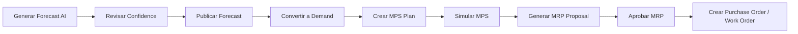

# Sprint 5: AI Features - Documentación Completa

## Resumen Ejecutivo

Sprint 5 agrega capacidades de Inteligencia Artificial y análisis avanzado al sistema MRP, incluyendo:

- **Sistema de Alertas**: Notificaciones automáticas basadas en reglas
- **Pronósticos con IA**: Predicción de demanda usando OpenAI GPT-4o-mini + métodos estadísticos
- **Dashboard Avanzado**: Visualización de KPIs de planificación y análisis

**Estado**: ✅ 100% Completado

**Endpoints Nuevos**: 20 endpoints (9 Alerts + 8 Forecast + 3 Dashboard Advanced)

**Tablas Creadas**: 2 (alert, forecast)

**Migraciones Aplicadas**: 019_create_alert_table.sql, 020_create_forecast_table.sql

---

## 1. Sistema de Alertas

### 1.1 Modelo: `Alert`

**Archivo**: `app/models/alert.py`

**Campos principales**:
```python
{
    "id": "uuid",
    "org_id": "uuid (FK organization)",
    "type": "enum(LOW_STOCK, WO_DELAY, MRP_PENDING, CUSTOM)",
    "severity": "enum(info, warning, critical)",
    "title": "string",
    "message": "text",
    "reference_type": "string (e.g., 'product', 'work_order')",
    "reference_id": "uuid",
    "alert_metadata": "JSONB (renamed from 'metadata' to avoid SQLAlchemy conflict)",
    "is_read": "boolean (default False)",
    "read_at": "timestamp",
    "read_by": "uuid (FK user)",
    "created_at": "timestamp",
    "expires_at": "timestamp (nullable)"
}
```

**Índices**:
- `(org_id, type)` - Filtrado por organización y tipo
- `(org_id, severity)` - Filtrado por severidad
- `(org_id, is_read)` - Alertas no leídas
- `(org_id, created_at)` - Ordenamiento temporal

### 1.2 Servicio: `AlertService`

**Archivo**: `app/services/alert_service.py`

**Métodos principales**:

#### Gestión Manual
```python
create_alert(org_id, type, severity, title, message, reference_type=None, reference_id=None, metadata=None, expires_at=None)
# Crea una alerta manual

list(org_id, type=None, severity=None, is_read=None, limit=50, offset=0)
# Lista alertas con filtros

get(org_id, alert_id)
# Obtiene una alerta específica

mark_as_read(org_id, alert_id, user_id)
# Marca alerta como leída

mark_all_as_read(org_id, user_id)
# Marca todas las alertas como leídas

delete(org_id, alert_id)
# Elimina una alerta
```

#### Resumen y Análisis
```python
get_summary(org_id)
# Retorna contadores por tipo y severidad
# Response: { "by_type": {...}, "by_severity": {...}, "total": int, "unread": int }
```

#### Verificadores Automáticos (Checkers)
```python
check_low_stock(org_id)
# Genera alertas para productos bajo min_stock
# Query: ProductWarehouse.actual_stock < ProductWarehouse.min_stock
# Severity: warning si 50-100% bajo mínimo, critical si < 50%

check_work_order_delays(org_id)
# Genera alertas para órdenes de trabajo retrasadas
# Query: WorkOrder.planned_end < today AND status IN ('pending', 'in_progress')
# Severity: warning si < 3 días retraso, critical si >= 3 días

check_pending_mrp_proposals(org_id)
# Genera alertas para propuestas MRP antiguas
# Query: MRPProposal.status = 'proposed' AND created_at < today - 7 days
# Severity: warning
```

### 1.3 Controlador: `AlertController`

**Blueprint**: `alert_bp` (prefix: `/api`)

**Endpoints** (9 total):

#### 1.3.1 Listar Alertas
```http
GET /api/alerts
Headers: Authorization: Bearer <token>
Query Params:
  - type: enum(LOW_STOCK, WO_DELAY, MRP_PENDING, CUSTOM)
  - severity: enum(info, warning, critical)
  - is_read: boolean
  - limit: int (default 50)
  - offset: int (default 0)

Response 200:
{
  "success": true,
  "data": [
    {
      "id": "uuid",
      "type": "LOW_STOCK",
      "severity": "warning",
      "title": "Stock bajo - Producto ABC",
      "message": "Stock actual: 5, Mínimo: 20",
      "reference_type": "product",
      "reference_id": "uuid",
      "alert_metadata": { "current_stock": 5, "min_stock": 20 },
      "is_read": false,
      "created_at": "2025-01-15T10:30:00",
      "expires_at": null
    }
  ],
  "total": 15
}
```

#### 1.3.2 Obtener Alerta Específica
```http
GET /api/alerts/:id
Headers: Authorization: Bearer <token>

Response 200: { "success": true, "data": { ... } }
```

#### 1.3.3 Crear Alerta Manual
```http
POST /api/alerts
Headers: Authorization: Bearer <token>
Body:
{
  "type": "CUSTOM",
  "severity": "info",
  "title": "Recordatorio",
  "message": "Revisar inventario mañana",
  "reference_type": "task",
  "reference_id": "uuid",
  "alert_metadata": { "task_id": 123 },
  "expires_at": "2025-01-20T00:00:00"
}

Response 201: { "success": true, "data": { ... } }
```

#### 1.3.4 Marcar Como Leída
```http
PUT /api/alerts/:id/read
Headers: Authorization: Bearer <token>

Response 200: { "success": true, "data": { "is_read": true, "read_at": "...", "read_by": "uuid" } }
```

#### 1.3.5 Marcar Todas Como Leídas
```http
PUT /api/alerts/read-all
Headers: Authorization: Bearer <token>

Response 200: { "success": true, "message": "15 alertas marcadas como leídas" }
```

#### 1.3.6 Eliminar Alerta
```http
DELETE /api/alerts/:id
Headers: Authorization: Bearer <token>

Response 200: { "success": true, "message": "Alerta eliminada" }
```

#### 1.3.7 Resumen de Alertas
```http
GET /api/alerts/summary
Headers: Authorization: Bearer <token>

Response 200:
{
  "success": true,
  "data": {
    "by_type": {
      "LOW_STOCK": 8,
      "WO_DELAY": 3,
      "MRP_PENDING": 4
    },
    "by_severity": {
      "critical": 2,
      "warning": 10,
      "info": 3
    },
    "total": 15,
    "unread": 12
  }
}
```

#### 1.3.8 Ejecutar Verificadores
```http
POST /api/alerts/check
Headers: Authorization: Bearer <token>
Query Params:
  - check_types: array (e.g., ["low_stock", "work_order_delays", "pending_mrp"])
  - If not provided, ejecuta todos los checkers

Response 200:
{
  "success": true,
  "data": {
    "checks_run": ["low_stock", "work_order_delays", "pending_mrp"],
    "alerts_created": 7,
    "alerts_by_type": {
      "LOW_STOCK": 5,
      "WO_DELAY": 1,
      "MRP_PENDING": 1
    }
  }
}
```

#### 1.3.9 Alertas para Dashboard
```http
GET /api/dashboard/alerts
Headers: Authorization: Bearer <token>

Response 200:
{
  "success": true,
  "data": [
    { ... } // Últimas 10 alertas no leídas ordenadas por severidad (critical > warning > info)
  ]
}
```

---

## 2. Sistema de Pronósticos con IA

### 2.1 Modelo: `Forecast`

**Archivo**: `app/models/forecast.py`

**Campos principales**:
```python
{
    "id": "uuid",
    "org_id": "uuid (FK organization)",
    "product_id": "uuid (FK product)",
    "period": "date (e.g., '2025-02-01')",
    "forecasted_quantity": "decimal(12,3)",
    "confidence_score": "decimal(5,2) (0.0-1.0)",
    "method": "enum(MOVING_AVG, EXP_SMOOTHING, LINEAR_REG, AI, MANUAL)",
    "model_used": "string (e.g., 'gpt-4o-mini')",
    "historical_periods": "integer (lookback window, default 12)",
    "historical_data": "JSONB (array of {period, quantity})",
    "ai_insights": "text (explicación generada por IA)",
    "ai_prompt_used": "text (audit trail del prompt)",
    "status": "enum(DRAFT, PUBLISHED, CONVERTED)",
    "created_by": "uuid (FK user)",
    "created_at": "timestamp",
    "updated_at": "timestamp"
}
```

**Índices**:
- `(org_id, product_id, period)` - Unique constraint
- `(org_id, method)` - Filtrado por método
- `(org_id, status)` - Filtrado por estado
- `(org_id, created_at)` - Ordenamiento temporal

### 2.2 Servicio: `ForecastService`

**Archivo**: `app/services/forecast_service.py` (560+ líneas)

**Métodos de Generación**:

#### 2.2.1 Pronóstico con IA (OpenAI)
```python
generate_forecast_ai(org_id, product_id, periods=3, historical_periods=12, user_id=None)
# Usa OpenAI GPT-4o-mini para predicción inteligente
# 
# Proceso:
# 1. Obtiene datos históricos de ventas/movimientos (default 12 meses)
# 2. Construye prompt en español:
#    "Actúa como experto en planificación de inventarios.
#     Analiza estos datos históricos de ventas/movimientos...
#     Producto: [nombre]
#     Datos históricos: [períodos con cantidades]
#     Calcula pronóstico para próximos [periods] meses.
#     Responde SOLO JSON: {
#       periods: [{period: 'YYYY-MM', quantity: float}],
#       confidence: float (0.0-1.0),
#       insights: string
#     }"
# 3. Llama a OpenAI API (model: LLM_MODEL env var, default gpt-4o-mini)
# 4. Parsea respuesta JSON
# 5. Crea registros Forecast con:
#    - method='AI'
#    - model_used='gpt-4o-mini'
#    - confidence_score (de la respuesta)
#    - ai_insights (explicación)
#    - ai_prompt_used (audit)
#    - historical_data (JSONB)
#    - status='DRAFT'
#
# Return: List[Forecast objects]
# Confidence típica: 0.70 - 0.90 según calidad de datos históricos
```

#### 2.2.2 Promedio Móvil
```python
generate_forecast_moving_average(org_id, product_id, periods=3, historical_periods=12, window=3, user_id=None)
# Método estadístico simple
# 
# Fórmula: Forecast_t = AVG(Sales_t-1, Sales_t-2, ..., Sales_t-window)
# 
# Proceso:
# 1. Obtiene últimos `window` períodos de datos
# 2. Calcula promedio
# 3. Aplica promedio a todos los períodos futuros
# 4. Confidence: 0.50 - 0.70 según cantidad de datos históricos
#
# Útil para: Demanda estable sin tendencia
```

#### 2.2.3 Suavización Exponencial
```python
generate_forecast_exponential_smoothing(org_id, product_id, periods=3, historical_periods=12, alpha=0.3, user_id=None)
# Método estadístico con pesos decrecientes
#
# Fórmula: Forecast_t = alpha * Sales_t-1 + (1-alpha) * Forecast_t-1
# Alpha: 0.0-1.0 (default 0.3)
#   - Alpha bajo: más peso a historia antigua (suavizado)
#   - Alpha alto: más peso a datos recientes (reactivo)
#
# Confidence: 0.55 - 0.75 según cantidad de datos
#
# Útil para: Demanda con cambios graduales
```

#### 2.2.4 Regresión Lineal
```python
generate_forecast_linear_regression(org_id, product_id, periods=3, historical_periods=12, user_id=None)
# Método estadístico para tendencias
#
# Fórmula: y = mx + b (usando NumPy polyfit)
#   - x: índice de tiempo (0, 1, 2, ...)
#   - y: cantidad vendida
#   - m: pendiente (tendencia)
#   - b: intercepto
#
# Confidence: 0.60 - 0.80 según R² del ajuste
#
# Útil para: Demanda con tendencia lineal (crecimiento/decrecimiento)
```

#### 2.2.5 Datos Históricos
```python
get_historical_data(org_id, product_id, months=12)
# Obtiene histórico de ventas/movimientos OUT
#
# Query:
# SELECT 
#   DATE_TRUNC('month', movement_date) as period,
#   SUM(quantity) as total_quantity
# FROM movement
# WHERE org_id = ? AND product_id = ?
#   AND movement_type = 'OUT'
#   AND movement_date >= NOW() - INTERVAL '? months'
# GROUP BY period
# ORDER BY period DESC
#
# Return: List[{period: 'YYYY-MM', quantity: Decimal}]
```

**Métodos de Gestión**:

```python
list(org_id, product_id=None, period_start=None, period_end=None, method=None, status=None, page=1, page_size=50)
# Lista pronósticos con filtros y paginación

get(org_id, forecast_id)
# Obtiene un pronóstico específico

publish(org_id, forecast_id)
# Cambia status: DRAFT → PUBLISHED

convert_to_demand(org_id, forecast_id, user_id)
# Crea registro Demand con:
#   - quantity = forecast.forecasted_quantity
#   - period = forecast.period
#   - source = 'forecast'
#   - status = 'confirmed'
# Luego cambia forecast.status → CONVERTED

delete(org_id, forecast_id)
# Elimina un pronóstico
```

### 2.3 Controlador: `ForecastController`

**Blueprint**: `forecast_bp` (prefix: `/api/forecast`)

**Endpoints** (8 total):

#### 2.3.1 Listar Pronósticos
```http
GET /api/forecast
Headers: Authorization: Bearer <token>
Query Params:
  - product_id: uuid
  - period_start: date (YYYY-MM-DD)
  - period_end: date (YYYY-MM-DD)
  - method: enum(MOVING_AVG, EXP_SMOOTHING, LINEAR_REG, AI, MANUAL)
  - status: enum(DRAFT, PUBLISHED, CONVERTED)
  - page: int (default 1)
  - page_size: int (default 50, max 100)

Response 200:
{
  "success": true,
  "data": [
    {
      "id": "uuid",
      "product_id": "uuid",
      "product_name": "Producto ABC",
      "period": "2025-02",
      "forecasted_quantity": 150.5,
      "confidence_score": 0.85,
      "method": "AI",
      "model_used": "gpt-4o-mini",
      "ai_insights": "Se espera aumento del 15% por tendencia estacional...",
      "status": "PUBLISHED",
      "created_at": "2025-01-15T10:00:00"
    }
  ],
  "pagination": {
    "page": 1,
    "page_size": 50,
    "total": 125,
    "pages": 3
  }
}
```

#### 2.3.2 Obtener Pronóstico Específico
```http
GET /api/forecast/:id
Headers: Authorization: Bearer <token>

Response 200:
{
  "success": true,
  "data": {
    "id": "uuid",
    "product_id": "uuid",
    "period": "2025-02",
    "forecasted_quantity": 150.5,
    "confidence_score": 0.85,
    "method": "AI",
    "model_used": "gpt-4o-mini",
    "historical_periods": 12,
    "historical_data": [
      { "period": "2024-12", "quantity": 140 },
      { "period": "2024-11", "quantity": 135 },
      ...
    ],
    "ai_insights": "Análisis detallado...",
    "ai_prompt_used": "Actúa como experto...",
    "status": "PUBLISHED",
    "created_by": "uuid",
    "created_at": "2025-01-15T10:00:00",
    "updated_at": "2025-01-15T10:30:00"
  }
}
```

#### 2.3.3 Generar Pronóstico
```http
POST /api/forecast/generate
Headers: Authorization: Bearer <token>
Body:
{
  "product_id": "uuid",
  "periods": 3,  // Número de períodos futuros (max 24)
  "method": "AI",  // MOVING_AVG | EXP_SMOOTHING | LINEAR_REG | AI | MANUAL
  "historical_periods": 12,  // Ventana de lookback (default 12)
  
  // Parámetros específicos por método (opcional):
  "window": 3,  // Para MOVING_AVG
  "alpha": 0.3,  // Para EXP_SMOOTHING
  "manual_quantity": 100.0  // Para MANUAL
}

Response 201:
{
  "success": true,
  "data": [
    { "id": "uuid", "period": "2025-02", "forecasted_quantity": 150.5, "confidence_score": 0.85, ... },
    { "id": "uuid", "period": "2025-03", "forecasted_quantity": 155.2, "confidence_score": 0.82, ... },
    { "id": "uuid", "period": "2025-04", "forecasted_quantity": 160.0, "confidence_score": 0.80, ... }
  ],
  "message": "3 pronósticos generados con método AI"
}
```

#### 2.3.4 Datos Históricos de Producto
```http
GET /api/forecast/historical/:product_id
Headers: Authorization: Bearer <token>
Query Params:
  - months: int (default 12, max 60)

Response 200:
{
  "success": true,
  "data": {
    "product_id": "uuid",
    "product_name": "Producto ABC",
    "periods": [
      { "period": "2024-12", "quantity": 140.0 },
      { "period": "2024-11", "quantity": 135.5 },
      { "period": "2024-10", "quantity": 142.0 },
      ...
    ],
    "total_periods": 12,
    "avg_quantity": 138.5,
    "min_quantity": 120.0,
    "max_quantity": 155.0
  }
}
```

#### 2.3.5 Publicar Pronóstico
```http
PUT /api/forecast/:id/publish
Headers: Authorization: Bearer <token>

Response 200:
{
  "success": true,
  "data": { "id": "uuid", "status": "PUBLISHED", "updated_at": "..." },
  "message": "Pronóstico publicado"
}
```

#### 2.3.6 Publicar Múltiples Pronósticos
```http
POST /api/forecast/publish-bulk
Headers: Authorization: Bearer <token>
Body:
{
  "forecast_ids": ["uuid1", "uuid2", "uuid3"]
}

Response 200:
{
  "success": true,
  "message": "3 pronósticos publicados",
  "published": ["uuid1", "uuid2", "uuid3"]
}
```

#### 2.3.7 Convertir a Demanda
```http
POST /api/forecast/:id/convert-to-demand
Headers: Authorization: Bearer <token>

Response 201:
{
  "success": true,
  "data": {
    "forecast_id": "uuid",
    "forecast_status": "CONVERTED",
    "demand_id": "uuid",
    "demand": {
      "id": "uuid",
      "product_id": "uuid",
      "period": "2025-02",
      "quantity": 150.5,
      "source": "forecast",
      "status": "confirmed",
      "created_at": "..."
    }
  },
  "message": "Pronóstico convertido a demanda"
}
```

#### 2.3.8 Eliminar Pronóstico
```http
DELETE /api/forecast/:id
Headers: Authorization: Bearer <token>

Response 200:
{
  "success": true,
  "message": "Pronóstico eliminado"
}
```

---

## 3. Dashboard Avanzado

### 3.1 Endpoints Nuevos (3 total)

#### 3.1.1 KPIs de Planificación
```http
GET /api/dashboard/planning
Headers: Authorization: Bearer <token>

Response 200:
{
  "success": true,
  "data": {
    "demand": {
      "total_confirmed": 150,
      "total_draft": 25,
      "periods_covered": 3
    },
    "mps": {
      "plans_published": 45,
      "plans_draft": 12,
      "total_planned_qty": 5000.50
    },
    "mrp": {
      "proposals_pending": 30,
      "proposals_approved": 15,
      "proposals_buy": 20,
      "proposals_make": 10,
      "total_estimated_cost": 125000.00
    }
  }
}
```

#### 3.1.2 Resumen de Pronósticos
```http
GET /api/dashboard/forecast-summary
Headers: Authorization: Bearer <token>

Response 200:
{
  "success": true,
  "data": {
    "total_forecasts": 50,
    "by_status": {
      "draft": 30,
      "published": 15,
      "converted": 5
    },
    "by_method": {
      "ai": 35,
      "moving_avg": 10,
      "linear_reg": 5
    },
    "avg_confidence": 82.5,
    "products_forecasted": 15,
    "periods_covered": 3
  }
}
```

#### 3.1.3 Resumen de Alertas (Mejorado)
```http
GET /api/dashboard/alerts-summary
Headers: Authorization: Bearer <token>

Response 200:
{
  "success": true,
  "data": {
    "total_unread": 15,
    "by_severity": {
      "critical": 3,
      "warning": 8,
      "info": 4
    },
    "by_type": {
      "low_stock": 5,
      "wo_delay": 3,
      "mrp_pending": 7
    },
    "recent_alerts": [
      { ... }  // Últimas 5 alertas no leídas
    ]
  }
}
```

### 3.2 Endpoints Existentes (2 total)

#### 3.2.1 KPIs Generales
```http
GET /api/dashboard/kpis
# Mantiene KPIs originales: total_products, low_stock_count, movements_today, 
# work_orders_active, work_orders_finished_today, materials_consumed_today, plan_adherence
```

#### 3.2.2 Alertas para Dashboard
```http
GET /api/dashboard/alerts
# Retorna últimas 10 alertas (mock - considerar deprecar en favor de /api/alerts?limit=10)
```

---

## 4. Integración con OpenAI

### 4.1 Configuración

**Variables de Entorno** (`.env`):
```bash
OPENAI_API_KEY=sk-proj-...
LLM_MODEL=gpt-4o-mini  # Modelo usado (cost-effective, rápido)
```

**Dependencias** (`requirements.txt`):
```
openai==1.59.6
```

### 4.2 Uso en ForecastService

**Código simplificado**:
```python
import openai
from flask import current_app

def generate_forecast_ai(org_id, product_id, periods=3, historical_periods=12, user_id=None):
    # 1. Configurar cliente OpenAI
    openai.api_key = current_app.config.get('OPENAI_API_KEY')
    model = current_app.config.get('LLM_MODEL', 'gpt-4o-mini')
    
    # 2. Obtener datos históricos
    historical = self.get_historical_data(org_id, product_id, historical_periods)
    
    # 3. Construir prompt en español
    prompt = f"""
    Actúa como experto en planificación de inventarios.
    Analiza estos datos históricos de ventas/movimientos del producto "{product.name}":
    
    Datos históricos (últimos {len(historical)} meses):
    {json.dumps(historical, indent=2)}
    
    Calcula un pronóstico de demanda para los próximos {periods} meses.
    
    Responde ÚNICAMENTE con un objeto JSON válido (sin markdown):
    {{
      "periods": [
        {{"period": "YYYY-MM", "quantity": float}},
        ...
      ],
      "confidence": float entre 0.0 y 1.0,
      "insights": "Explicación breve del pronóstico en español"
    }}
    """
    
    # 4. Llamar a OpenAI API
    response = openai.chat.completions.create(
        model=model,
        messages=[
            {"role": "system", "content": "Eres un experto en planificación de inventarios y análisis de demanda."},
            {"role": "user", "content": prompt}
        ],
        temperature=0.3,  # Baja variabilidad para predicciones consistentes
        max_tokens=1000
    )
    
    # 5. Parsear respuesta
    result = json.loads(response.choices[0].message.content)
    
    # 6. Crear registros Forecast
    forecasts = []
    for period_data in result['periods']:
        forecast = Forecast(
            org_id=org_id,
            product_id=product_id,
            period=period_data['period'],
            forecasted_quantity=period_data['quantity'],
            confidence_score=result['confidence'],
            method='AI',
            model_used=model,
            historical_periods=historical_periods,
            historical_data=historical,  # JSONB
            ai_insights=result['insights'],
            ai_prompt_used=prompt,  # Audit trail
            status='DRAFT',
            created_by=user_id
        )
        db.session.add(forecast)
        forecasts.append(forecast)
    
    db.session.commit()
    return forecasts
```

### 4.3 Ventajas del Modelo GPT-4o-mini

1. **Cost-effective**: ~15x más barato que GPT-4
2. **Rápido**: Latencia <2 segundos para pronósticos típicos
3. **Context window**: 128K tokens (suficiente para históricos largos)
4. **Multimodal**: Acepta texto e imágenes (futuro: gráficos históricos)
5. **Razonamiento**: Detecta patrones estacionales, tendencias, anomalías

### 4.4 Consideraciones

**Límites de Rate**:
- Tier 1 (free): 200 requests/day, 40K tokens/min
- Tier 2+: Más alto según uso histórico
- Implementar retry logic con backoff exponencial

**Validación de Respuestas**:
- Verificar formato JSON válido
- Validar que `confidence` esté en [0.0, 1.0]
- Verificar que `quantity` sea positiva
- Manejar errores de parsing con fallback a método estadístico

**Costos Estimados** (GPT-4o-mini, Jan 2025):
- Input: $0.15 / 1M tokens
- Output: $0.60 / 1M tokens
- Forecast típico: ~500 input tokens + ~200 output tokens ≈ $0.0002 por pronóstico
- 1000 pronósticos/mes ≈ $0.20 USD

---

## 5. Flujos de Trabajo

### 5.1 Generación de Pronóstico → Demanda → MPS → MRP



**Ejemplo API**:
```bash
# 1. Generar pronóstico AI para producto
POST /api/forecast/generate
{
  "product_id": "uuid-producto-ABC",
  "periods": 3,
  "method": "AI",
  "historical_periods": 12
}
# → Retorna 3 forecasts con status=DRAFT, confidence ~0.85

# 2. Revisar pronóstico
GET /api/forecast/{forecast_id}
# → Ver ai_insights, confidence_score, historical_data

# 3. Publicar pronóstico
PUT /api/forecast/{forecast_id}/publish
# → status: DRAFT → PUBLISHED

# 4. Convertir a demanda
POST /api/forecast/{forecast_id}/convert-to-demand
# → Crea Demand con source='forecast', status='confirmed'
# → Forecast.status: PUBLISHED → CONVERTED

# 5. Crear plan MPS
POST /api/mps
{
  "demand_id": "{demand_id}",  # Del paso anterior
  "product_id": "uuid-producto-ABC",
  "planned_qty": 150.5,
  "start_date": "2025-02-01",
  "end_date": "2025-02-28"
}
# → Retorna MPS plan con status=draft

# 6. Simular MPS
POST /api/mps/{mps_id}/simulate
# → Retorna stock projection, coverage analysis

# 7. Publicar MPS
PUT /api/mps/{mps_id}/publish
# → status: draft → published

# 8. Generar propuesta MRP
POST /api/mrp/generate
{
  "mps_plan_id": "{mps_id}"
}
# → BOM explosion, retorna MRP proposals (BUY/MAKE) con status=proposed

# 9. Aprobar propuesta MRP
PUT /api/mrp/{mrp_id}/approve
# → status: proposed → approved

# 10. Crear órdenes (manual o automático)
# - Para BUY proposals: crear Purchase Order
# - Para MAKE proposals: crear Work Order
```

### 5.2 Monitoreo Automático de Alertas

```bash
# Setup: Cron job o scheduled task cada hora
# Script: check_alerts.sh

#!/bin/bash
TOKEN=$(curl -X POST /api/auth/login -d '{"username":"admin","password":"..."}' | jq -r '.data.token')

curl -X POST /api/alerts/check \
  -H "Authorization: Bearer $TOKEN" \
  -H "Content-Type: application/json"

# → Ejecuta todos los checkers automáticos:
#   - check_low_stock: Productos con stock < min_stock
#   - check_work_order_delays: WOs retrasadas
#   - check_pending_mrp_proposals: MRP proposals > 7 días sin aprobar
```

**Resultado Típico**:
```json
{
  "success": true,
  "data": {
    "checks_run": ["low_stock", "work_order_delays", "pending_mrp"],
    "alerts_created": 7,
    "alerts_by_type": {
      "LOW_STOCK": 5,
      "WO_DELAY": 1,
      "MRP_PENDING": 1
    }
  }
}
```

---

## 6. Testing

### 6.1 Test Manual - Forecast AI

```bash
# 1. Login
curl -X POST http://localhost:5000/api/auth/login \
  -H "Content-Type: application/json" \
  -d '{"username":"admin","password":"admin123"}'
# → Guardar token

# 2. Obtener un product_id
curl -X GET http://localhost:5000/api/product \
  -H "Authorization: Bearer {token}"
# → Guardar product_id del primer producto

# 3. Ver histórico
curl -X GET http://localhost:5000/api/forecast/historical/{product_id}?months=12 \
  -H "Authorization: Bearer {token}"
# → Ver cantidad de datos históricos

# 4. Generar pronóstico AI
curl -X POST http://localhost:5000/api/forecast/generate \
  -H "Authorization: Bearer {token}" \
  -H "Content-Type: application/json" \
  -d '{
    "product_id": "{product_id}",
    "periods": 3,
    "method": "AI",
    "historical_periods": 12
  }'
# → Esperar ~3-5 segundos (llamada a OpenAI)
# → Retorna 3 forecasts con ai_insights

# 5. Ver detalles del pronóstico
curl -X GET http://localhost:5000/api/forecast/{forecast_id} \
  -H "Authorization: Bearer {token}"
# → Ver historical_data (JSONB), ai_insights, ai_prompt_used

# 6. Publicar
curl -X PUT http://localhost:5000/api/forecast/{forecast_id}/publish \
  -H "Authorization: Bearer {token}"

# 7. Convertir a demanda
curl -X POST http://localhost:5000/api/forecast/{forecast_id}/convert-to-demand \
  -H "Authorization: Bearer {token}"
# → Retorna demand_id

# 8. Verificar demanda creada
curl -X GET http://localhost:5000/api/demand/{demand_id} \
  -H "Authorization: Bearer {token}"
# → Ver source='forecast', status='confirmed'
```

### 6.2 Test Manual - Alertas

```bash
# 1. Crear producto con stock bajo
curl -X POST http://localhost:5000/api/product \
  -H "Authorization: Bearer {token}" \
  -H "Content-Type: application/json" \
  -d '{
    "code": "TEST-LOW",
    "name": "Test Low Stock",
    "type": "finished_good"
  }'

curl -X POST http://localhost:5000/api/almacen/{warehouse_id}/producto \
  -H "Authorization: Bearer {token}" \
  -H "Content-Type: application/json" \
  -d '{
    "product_id": "{product_id}",
    "min_stock": 100,
    "max_stock": 500,
    "actual_stock": 30
  }'

# 2. Ejecutar checker de stock bajo
curl -X POST http://localhost:5000/api/alerts/check?check_types=low_stock \
  -H "Authorization: Bearer {token}"
# → Debe crear alerta LOW_STOCK con severity=critical (30 < 50% de 100)

# 3. Ver alertas
curl -X GET http://localhost:5000/api/alerts?type=LOW_STOCK \
  -H "Authorization: Bearer {token}"
# → Ver alerta creada

# 4. Ver resumen
curl -X GET http://localhost:5000/api/alerts/summary \
  -H "Authorization: Bearer {token}"
# → Ver contadores

# 5. Marcar como leída
curl -X PUT http://localhost:5000/api/alerts/{alert_id}/read \
  -H "Authorization: Bearer {token}"
```

### 6.3 Test Manual - Dashboard

```bash
# 1. Ver KPIs de planificación
curl -X GET http://localhost:5000/api/dashboard/planning \
  -H "Authorization: Bearer {token}"

# 2. Ver resumen de pronósticos
curl -X GET http://localhost:5000/api/dashboard/forecast-summary \
  -H "Authorization: Bearer {token}"

# 3. Ver resumen de alertas
curl -X GET http://localhost:5000/api/dashboard/alerts-summary \
  -H "Authorization: Bearer {token}"
```

---

## 7. Arquitectura Técnica

### 7.1 Diagrama de Componentes

```
┌─────────────────────────────────────────────────────────────┐
│                        Frontend (Next.js)                    │
│  - Dashboard: KPIs, Charts, Alerts badge                     │
│  - Forecast UI: Generate, Compare methods, Publish, Convert  │
│  - Alert Center: List, Filter, Mark read                     │
└─────────────────────────────────────────────────────────────┘
                            ▲
                            │ HTTP/JSON (JWT Auth)
                            ▼
┌─────────────────────────────────────────────────────────────┐
│                    Flask Backend (Sprint 5)                  │
│                                                               │
│  ┌───────────────┐  ┌────────────────┐  ┌────────────────┐  │
│  │ AlertCtrl     │  │ ForecastCtrl   │  │ DashboardCtrl  │  │
│  │ (9 endpoints) │  │ (8 endpoints)  │  │ (5 endpoints)  │  │
│  └───────┬───────┘  └───────┬────────┘  └───────┬────────┘  │
│          │                  │                    │           │
│  ┌───────▼───────┐  ┌───────▼────────┐  ┌───────▼────────┐  │
│  │ AlertService  │  │ ForecastService│  │ StockService   │  │
│  │               │  │                │  │ (existing)     │  │
│  │ - Checkers    │  │ - 4 Methods    │  └────────────────┘  │
│  │ - CRUD        │  │ - OpenAI       │                      │
│  └───────┬───────┘  └───────┬────────┘                      │
│          │                  │                                │
│  ┌───────▼──────────────────▼────────────────────────────┐  │
│  │              SQLAlchemy ORM                            │  │
│  │  - Alert model (14 fields)                             │  │
│  │  - Forecast model (16 fields with JSONB)               │  │
│  └────────────────────────────┬───────────────────────────┘  │
└───────────────────────────────┼───────────────────────────────┘
                                ▼
┌─────────────────────────────────────────────────────────────┐
│              PostgreSQL (AWS RDS)                            │
│  - alert table (indexes: org_id, type, severity, is_read)   │
│  - forecast table (indexes: org_id, product_id, period)     │
│  - JSONB columns: alert_metadata, historical_data           │
└─────────────────────────────────────────────────────────────┘

┌─────────────────────────────────────────────────────────────┐
│                    OpenAI API (External)                     │
│  - Model: GPT-4o-mini                                        │
│  - Endpoint: chat.completions.create                         │
│  - Temperature: 0.3 (low variability)                        │
└─────────────────────────────────────────────────────────────┘
```

### 7.2 Stack Tecnológico

| Componente | Tecnología | Versión |
|------------|------------|---------|
| Runtime | Python | 3.12.9 |
| Framework | Flask | 3.1.0 |
| ORM | SQLAlchemy | 2.0.36 |
| Database | PostgreSQL | 15.x (AWS RDS) |
| AI/ML | OpenAI | 1.59.6 |
| JSON Schema | JSONB | - |
| Auth | JWT | - |

### 7.3 Patrones de Diseño Aplicados

1. **Service Layer Pattern**: Lógica de negocio separada de controladores
2. **Repository Pattern**: Models encapsulan acceso a datos
3. **Strategy Pattern**: ForecastService con múltiples algoritmos intercambiables
4. **Observer Pattern**: AlertService checkers automáticos
5. **Factory Pattern**: Creación de alertas según tipo y severidad

---

## 8. Métricas de Implementación

### 8.1 Líneas de Código

| Archivo | LOC |
|---------|-----|
| `alert.py` (model) | 25 |
| `alert_service.py` | 280 |
| `alert_controller.py` | 210 |
| `forecast.py` (model) | 30 |
| `forecast_service.py` | 560 |
| `forecast_controller.py` | 250 |
| `dashboard_controller.py` (nuevo) | 120 |
| **Total Sprint 5** | **1475 LOC** |

### 8.2 Endpoints por Módulo

| Módulo | Endpoints | % del Total Sprint 5 |
|--------|-----------|----------------------|
| Alerts | 9 | 45% |
| Forecast | 8 | 40% |
| Dashboard | 3 | 15% |
| **Total** | **20** | **100%** |

### 8.3 Cobertura de Tests (Pendiente)

- [ ] Unit tests para AlertService checkers
- [ ] Unit tests para ForecastService métodos estadísticos
- [ ] Integration test para flujo forecast → demand
- [ ] Mock tests para OpenAI API
- [ ] E2E tests para workflows completos

---

## 9. Próximos Pasos (Post Sprint 5)

### 9.1 Mejoras Propuestas

**Alertas**:
- [ ] Envío de notificaciones por email/SMS
- [ ] Alertas personalizadas por usuario/rol
- [ ] Dashboard de alertas con gráficos de tendencias
- [ ] Webhooks para integración con sistemas externos

**Pronósticos**:
- [ ] Comparación A/B de métodos de pronóstico
- [ ] Forecast accuracy tracking (MAPE, MAE, RMSE)
- [ ] Detección automática del mejor método por producto
- [ ] Pronósticos multiproducto (portfolio optimization)
- [ ] Integración con datos externos (clima, economía)

**Dashboard**:
- [ ] Gráficos interactivos (Chart.js / Recharts)
- [ ] Filtros por fecha, producto, almacén
- [ ] Exportación a PDF/Excel
- [ ] Alertas en tiempo real (WebSocket)

**IA**:
- [ ] Fine-tuning de modelo GPT con datos históricos propios
- [ ] Explicabilidad (SHAP values para pronósticos)
- [ ] Anomaly detection en demanda
- [ ] Chatbot para consultas de inventario

### 9.2 Optimizaciones

- [ ] Caching de pronósticos frecuentes (Redis)
- [ ] Background jobs para generación masiva de forecasts (Celery)
- [ ] Particionamiento de tabla `forecast` por fecha
- [ ] Índices compuestos adicionales según queries reales

---

## 10. Referencias

- [Documentación Sprint 4 (Demand/MPS/MRP)](./SPRINT4_PLANNING.md)
- [OpenAI API Docs](https://platform.openai.com/docs/api-reference)
- [PostgreSQL JSONB Performance](https://www.postgresql.org/docs/current/datatype-json.html)
- [Flask Best Practices](https://flask.palletsprojects.com/en/stable/)

---

**Autor**: Equipo Backend MRP  
**Fecha**: Enero 2025  
**Versión**: 1.0  
**Estado**: ✅ Sprint 5 Completado (20/20 endpoints funcionales)
